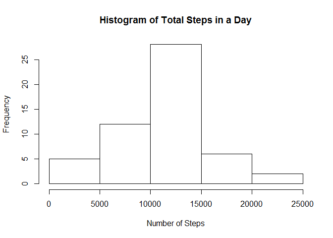
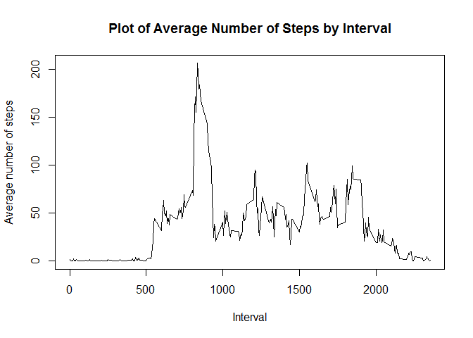
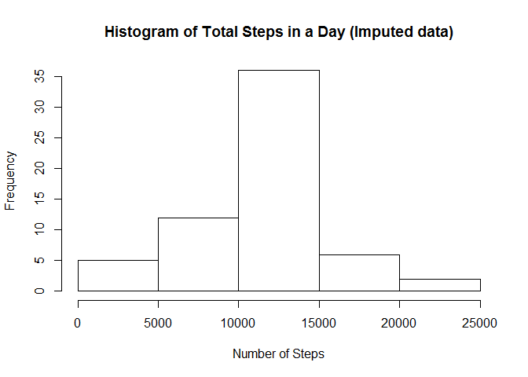
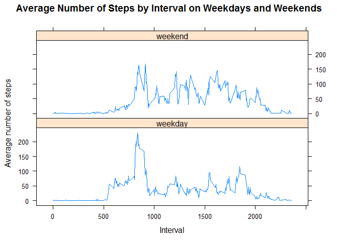

# Reproducible Research: Peer Assessment 1


## Loading and preprocessing the data

Here I set my usual working directory, load all the packages I use, then load the data. The only data cleaning I do at this point is making sure 'date' is the correct data type. 


```r
setwd("C:/Users/Michael/Documents/Rwork")
library('dplyr')
library('lubridate')
library('lattice')
dat <- read.table("activity.csv", header = TRUE,sep=",")
ymd(dat$date)->dat$date
```

## What is mean total number of steps taken per day?

Here I create a histogram for the total number of steps taken in a day.


```r
dat %>% group_by(date) %>% summarize(total=sum(steps)) -> totalsteps
hist(totalsteps$total, main="Histogram of Total Steps in a Day", xlab="Number of Steps",ylab="Frequency")
```

 

Here we report the actual mean and median number of steps per day.


```r
mean(totalsteps$total,na.rm=T)
```

```
## [1] 10766.19
```

```r
median(totalsteps$total,na.rm=T)
```

```
## [1] 10765
```

## What is the average daily activity pattern?

The following is a a time series plot of the average number of steps taken (averaged across all days) versus the 5-minute intervals.


```r
dat %>% group_by(interval) %>% summarize(ave=mean(steps,na.rm=T)) -> meansteps
plot(meansteps$interval,meansteps$ave,type='l', main="Plot of Average Number of Steps by Interval", xlab="Interval", ylab="Average number of steps")
```

 

We can also compute the 5-minute interval that, on average, contains the maximum number of steps.


```r
meansteps$interval[meansteps$ave==max(meansteps$ave)]
```

```
## [1] 835
```

The interval with the highest average number of steps is the one beginning with minute number 835.

## Imputing missing values

Our data has many missing values. Here is the amount of missing values.


```r
sum(is.na(dat$steps))
```

```
## [1] 2304
```

One strategy for dealing with this is to replace each missing number of steps with the average number of steps for that interval. Here I make another data frame with imputed data implementing this strategy.


```r
dat->dat2
for(i in 1:length(dat2$steps)){
  if(is.na(dat2$steps[i])){
  	dat2$steps[i] <- meansteps$ave[which(meansteps$interval == dat2$interval[i])]
	}
}
```

We can make another histogram of the total number of steps taken each day, this time with the imputed data.


```r
dat2 %>% group_by(date) %>% summarize(total=sum(steps)) -> totalstepsimputed
hist(totalstepsimputed$total, main="Histogram of Total Steps in a Day (Imputed data)", xlab="Number of Steps",ylab="Frequency")
```

 

We can also compute the mean and median of total steps taken per day, with the imputed data.


```r
mean(totalstepsimputed$total,na.rm=T)
```

```
## [1] 10766.19
```

```r
median(totalstepsimputed$total,na.rm=T)
```

```
## [1] 10766.19
```

As we can see, the imputing did not have a major effect on the mean and median.

## Are there differences in activity patterns between weekdays and weekends?

Now we can make a panel plot comparing the average number of steps taken per 5-minute interval across weekdays and weekends. First we split the data up into weekdays and weekends. Then we make the panel plot.


```r
dat2 %>% mutate(daytype = factor(ifelse(wday(date) == 7 | wday(date) == 1, "weekend", "weekday")))->dat2
dat2 %>% group_by(interval, daytype) %>% summarize(ave=mean(steps,na.rm=T)) -> splitmeans 
xyplot(ave~interval | daytype , splitmeans, main="Average Number of Steps by Interval on Weekdays and Weekends",type = "l",layout=c(1,2),xlab="Interval",ylab="Average number of steps")
```

 

